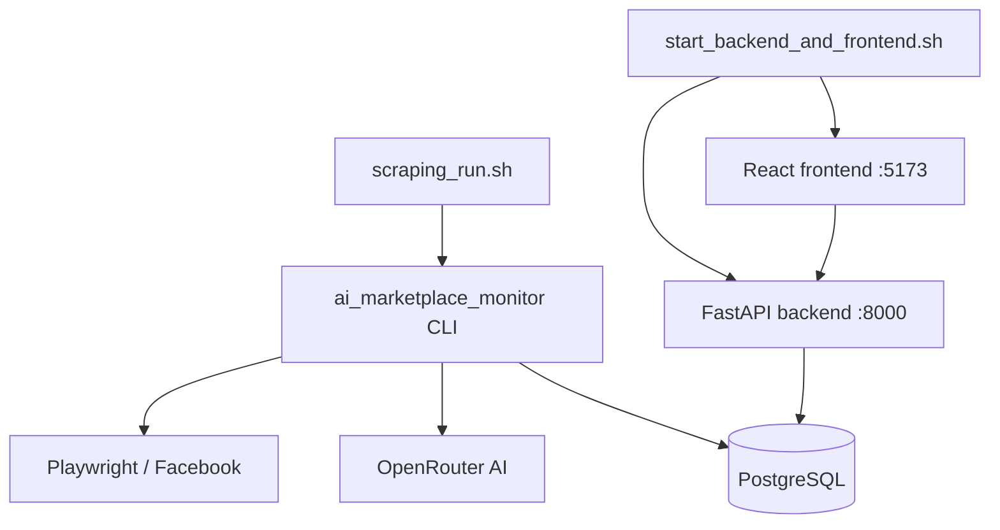

# 🛒 Facebook Marketplace Scan


> **⚠️ Educational purposes only.**
> This project is a personal learning exercise exploring browser automation, AI API integration, PostgreSQL caching, and full-stack dashboards. It is **not** intended for commercial use or large-scale scraping. Using automation tools on Facebook may violate [Facebook's Terms of Service](https://www.facebook.com/terms.php) — use responsibly and at your own risk.

---

A personal fork of [`ai-marketplace-monitor`](https://github.com/BoPeng/ai-marketplace-monitor) extended with:

- **PostgreSQL cache** — deduplicates listing observations and AI evaluations across runs
- **FastAPI + React dashboard** — browse listings, price history, and notifications locally
- **Rerun queue** — re-evaluate specific listings without a full scan
- **Tradera detection** — flags third-party Tradera integrations on Facebook Marketplace
- **Swedish locale support** — UI strings and city slugs tuned for Swedish Marketplace

---

## Architecture



---

## Tech Stack

| Layer | Technology |
|---|---|
| Scraper | Python 3.11+, Playwright, `ai-marketplace-monitor` |
| AI | OpenRouter (OpenAI-compatible) |
| Cache & Storage | PostgreSQL, psycopg 3, SQLAlchemy, Alembic |
| Dashboard API | FastAPI, Pydantic, Uvicorn |
| Dashboard UI | React 19, TypeScript, Vite, Tailwind CSS |
| Code Quality | Ruff, Black, pytest, GitHub Actions |

---

## Repository Layout

```
.
├── ai_marketplace_monitor/   # Vendored & extended scanner package
├── backend/                  # FastAPI dashboard API + Alembic migrations
├── frontend/                 # React + Vite dashboard UI
├── scripts/                  # Operational helpers (init DB, process queue, etc.)
├── tests/                    # Hermetic unit tests (no live DB or browser required)
├── docs/reference/           # Design and behaviour reference notes
├── .env.example              # Environment variable template — copy to .env
├── personal.toml.example     # Optional personal config overlay — copy to personal.toml
├── scraping_run.sh           # Scanner entrypoint
└── start_backend_and_frontend.sh  # Starts backend + frontend together
```

---

## Prerequisites

- **Python 3.11+** with `pip`
- **Node.js v20.19+ or v22+** (for the React dashboard)
- **PostgreSQL** database (local or Docker — see `scripts/docker_postgres_up.py`)
- Playwright browsers installed: `playwright install chromium`
- An [OpenRouter](https://openrouter.ai/keys) API key (free tier works)

---

## Quick Start

### 1. Clone and install Python dependencies

```bash
git clone https://github.com/YOUR_USERNAME/facebook_marketplace_scan.git
cd facebook_marketplace_scan

python3 -m venv .venv
source .venv/bin/activate
pip install -r requirements-dev.txt
playwright install chromium
```

### 2. Configure environment

```bash
cp .env.example .env
# Edit .env — at minimum set OPENROUTER_API_KEY and AIMM_DATABASE_URL
```

Key settings in `.env`:

| Variable | Description |
|---|---|
| `OPENROUTER_API_KEY` | AI scoring API key from openrouter.ai |
| `AIMM_DATABASE_URL` | PostgreSQL connection string |
| `AIMM_PG_CACHE_ENABLED` | `1` to enable the cache layer |
| `AIMM_REEVAL_ON_PRICE_CHANGE` | `1` to re-run AI when price changes |
| `AIMM_PROMPT_VERSION` | Bump when you change rating prompts |

### 3. Configure what to search for

The main runtime config lives in `~/.ai-marketplace-monitor/config.toml` (the standard `ai-marketplace-monitor` config location).

For repo-local overrides you can also create `personal.toml` in the repo root (gitignored):

```bash
cp personal.toml.example personal.toml
# Edit personal.toml — add your searches, AI settings, city, radius, etc.
```

Use `~/.ai-marketplace-monitor/config.toml` for long-lived searches shared across machines.
Use `personal.toml` for repo-specific experiments: temporary prompt changes, model switches, local notification routing, or Facebook credentials during development.

### 4. Bootstrap the database

```bash
python scripts/init_postgres_cache.py
```

Or spin up a local PostgreSQL container:

```bash
python scripts/docker_postgres_up.py
```

### 5. Run the scanner (Interactive Login)

```bash
./scraping_run.sh
```

**What to expect on first run:**
1. A **Chromium browser window** will open automatically.
2. **You must log in to Facebook** manually in this window.
3. The scanner uses a "storage state" to keep you logged in. That Playwright login state, including cookies/session tokens, is saved under your home directory in `~/.ai-marketplace-monitor/`, not inside this repository.
4. Once logged in, the scanner will begin navigating to the marketplace URLs defined in your config.

> [!TIP]
> If you get logged out or face a "Login required" error later, just run the scanner again. It will reopen the window for you to re-authenticate.

### 6. Run the dashboard

```bash
# Install frontend dependencies (first time only)
cd frontend && npm install && cd ..

# Start both backend API and frontend dev server
./start_backend_and_frontend.sh
```

| URL | Purpose |
|---|---|
| `http://127.0.0.1:8000` | Dashboard API |
| `http://127.0.0.1:8000/docs` | Interactive API docs (Swagger) |
| `http://127.0.0.1:5173` | React dashboard |

---

## Development

### Quality checks

Run these before every push:

```bash
ALLOW_PUSH_TO_MAIN=1 ./scripts/pre_push_check.sh
```

Install it as a real git hook if you want the check to run automatically:

```bash
./scripts/install_git_hooks.sh
```

Blocking checks:
- secret scanning and repo hygiene
- YAML/TOML validation
- `pip-audit`
- `pytest`
- frontend production build
- `npm audit --audit-level=high`

Advisory checks:
- `trailing-whitespace`
- `end-of-file-fixer`
- frontend lint

### What CI enforces

- Python import/lint correctness (Ruff)
- Python formatting (Black)
- Unit tests (pytest)
- Repository hygiene (no tracked secrets)
- Frontend production build
- Frontend lint is advisory in the local pre-push helper

### Useful scripts

| Script | Purpose |
|---|---|
| `scripts/init_postgres_cache.py` | Bootstrap DB schema |
| `scripts/docker_postgres_up.py` | Start a local Postgres container |
| `scripts/pg_cache_maintenance.py` | Vacuum old rows |
| `scripts/process_rerun_queue.py` | Drain the AI rerun queue |
| `scripts/rescrape_visa_mer.py` | Re-fetch listings with truncated descriptions |
| `scripts/check_repo_hygiene.py` | Verify no secrets are tracked |
| `scripts/pre_push_check.sh` | Run the local blocking/advisory pre-push checks |
| `scripts/install_git_hooks.sh` | Install `pre_push_check.sh` as `.git/hooks/pre-push` |

---

## Safety Notes

- Keep `.env` and `personal.toml` off version control (both are gitignored).
- Playwright browser session state is stored outside the repo in `~/.ai-marketplace-monitor/`; it is not intended to be committed from this repository.
- Do not commit browser session state, API keys, DB dumps, or private notes.
- Review `ai_marketplace_monitor/config.toml` before publishing — it should contain only safe defaults (region/translation definitions, no credentials).
- If a secret is ever committed accidentally: rotate it and clean the repository history immediately.

---

## Public Docs

- [Reference docs](docs/reference/README.md)
- [Contributing guide](CONTRIBUTING.md)
- [Security policy](SECURITY.md)

## Known Constraints

- Facebook's page structure changes frequently — parser code needs periodic maintenance.
- Most tests are unit-level and do not require a live Facebook session or PostgreSQL instance.
- This is a personal project; expect rough edges and Swedish-specific UI assumptions.

## License

[MIT](LICENSE) — see also the upstream [ai-marketplace-monitor](https://github.com/BoPeng/ai-marketplace-monitor) project.
